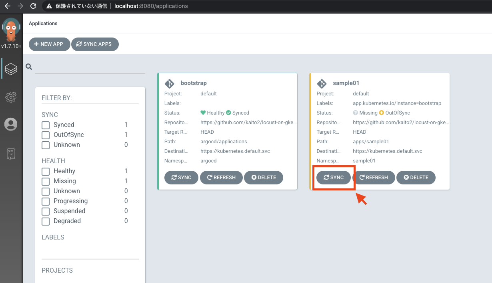
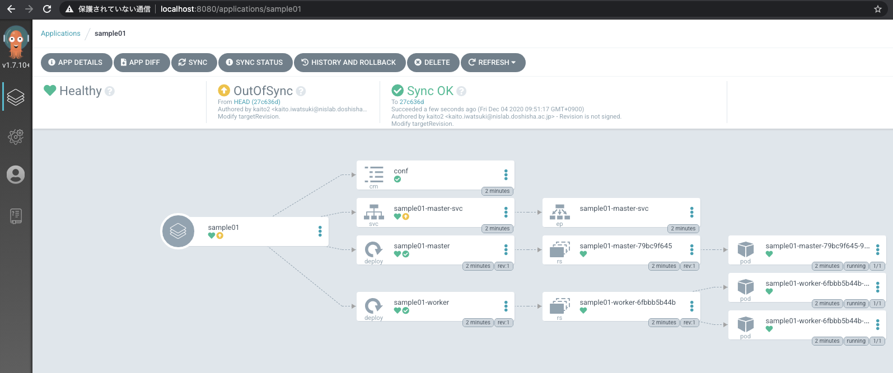

# Locust on GKE

GKE 上で Locust を使った負荷試験を実行するサンプルです。

## Requirements

- `gcloud`: latest
- `gsutil`: latest
- `kubectl`
- `terraform`: ">=0.13.5"

## Deploy

負荷試験用のクラスタをデプロイ

state ファイルを置くための GCS バケットを作成します。

```
$ ./scripts/create_tf_bucket.sh <YOUR_PROJECT_ID>
```

GKE クラスタをデプロイ

コマンド実行前に `infra/dev/main.tf` にある `<YOUR_GCP_PROJECT_ID>` を GPC のプロジェクト ID に置き換えてください。

```
$ cd infra/dev
$ terraform init
$ terraform apply
$ gcloud container clusters get-credentials load-testing-cluster-dev \
    --region asia-northeast1 --project <YOUR_PROJECT_ID>
$ cd ../..
```

Argo CD をセットアップ

CRD の反映タイミングによってはエラーになる可能性があるのでその場合は再度実行してください。

```
$ ./scripts/setup_argocd.sh
```

Locust は Argo CD によってデプロイされるのでポートフォワードしてアクセスします。

```
$ kubectl port-forward -n argocd svc/argocd-server 8080:443
```

ブラウザで `localhost:8080` をひらく。

- username: `admin`
- password: `admin`

NOTE: `scripts/setup_argocd.sh` ファイルの `admin.password` を変更してください。

ログイン後は以下のような画面が表示されるので、 `SYNC` をクリック。画面右側に選択項目が表示されるので、`SYNCRONIZE` をクリックするとサンプルの Locust がデプロイされます。



`sample01` のページへ移動し、 状態が `Sync OK` になっていればデプロイできています。



負荷試験対象として Nginx をデプロイしておきます。

```
$ kubectl run sample-service --image=nginx --restart=Never --port=80 --expose
```

次に、 Locust です。

```
$ kubectl port-forward -n sample01 svc/sample01-master-svc 8089:8089
```

`localhost:8089` をひらいて、 Locust にアクセスします。

`Number of users to simulate` と `Hatch rate` を指定し、 `Start swarming` を実行すると、負荷試験を実施することができます。

## Clean up

```
$ cd infra/dev
$ terraform destroy
```
